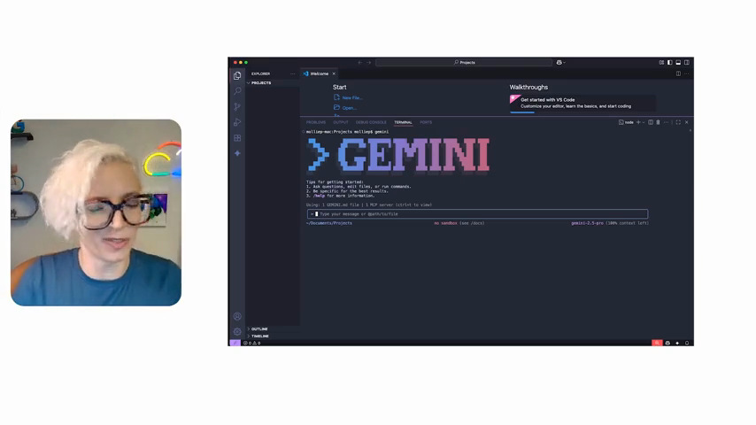

# Getting Started with Gemini CLI: My Chat with Taylor Mullin

By Molly Bennett

In our latest episode of *The Agent Factory*, Emma and I took a deep dive into the [Gemini CLI](https://github.com/google-gemini/gemini-cli). If you haven't tried it yet, it’s a powerful agent that lives right in your terminal. I've been using it for a few weeks now, and it's already a mainstay in my workflow.

*Emma and I getting ready to dive into the Gemini CLI.*

## Onboarding to a New Codebase in Minutes

One of the biggest headaches for any developer is onboarding onto a new project. You usually start by reading a massive README or digging through folders. 

During our demo, I didn't even clone the repo myself. I just asked the Gemini CLI to do it for me. I pointed it at Google’s Agent Development Kit (ADK) repo, and it found the link, asked for permission, and cloned it. 

*Starting the demo: cloning the Google ADK repo with just a prompt.*

Instead of reading pages of docs, I asked for a complete project audit. In one go, the CLI analyzed the architecture, identified the tech stack, and summarized the project’s purpose. It’s like having a senior dev sitting next to you, explaining exactly how everything fits together.

## Building the Tool with the Tool

We were lucky to have Taylor Mullin, the creator of Gemini CLI, join us to talk about the philosophy behind it. 

*Taylor Mullin sharing the origin story of the Gemini CLI.*

Taylor shared something that really blew my mind: they use the Gemini CLI to build the Gemini CLI. The first feature it built for itself was a markdown parser. Taylor was hitting a wall with existing frameworks, and the CLI offered to write a custom parser. That code is still used today to render everything you see in the terminal.

## The 100x Productivity Goal

Taylor talked about how AI makes it easy to "10x" yourself. The real challenge is reaching "100x." 

To get there, you have to think about parallel work. The Gemini CLI can spin up multiple threads to tackle different problems at the same time. This isn't just about faster typing; it's about changing how you work.

*Taylor discussing the path from 10x to 100x productivity.*

One of the coolest features we discussed is "self-healing." If the CLI tries a command and fails, it doesn't just stop. It looks at the error, figures out what went wrong, and suggests the steps to fix it. It’s that "scrappy developer" mindset built into a tool.

## What’s Next?

The roadmap for the Gemini CLI is all about extensibility. Soon, you'll be able to install extensions just as easily as you install npm packages. Whether you're a Go developer who needs a specific environment or a content creator looking to hook into social media APIs, these extensions will let you curate the tool to your exact needs.

## Try It Out

We're only scratching the surface of what this tool can do. If you want to speed up your everyday tasks and spend more time on the fun parts of coding, give the Gemini CLI a try.

You can find it on GitHub at [google-gemini/gemini-cli](https://github.com/google-gemini/gemini-cli). Check it out, join the community, and let us know what you build!
