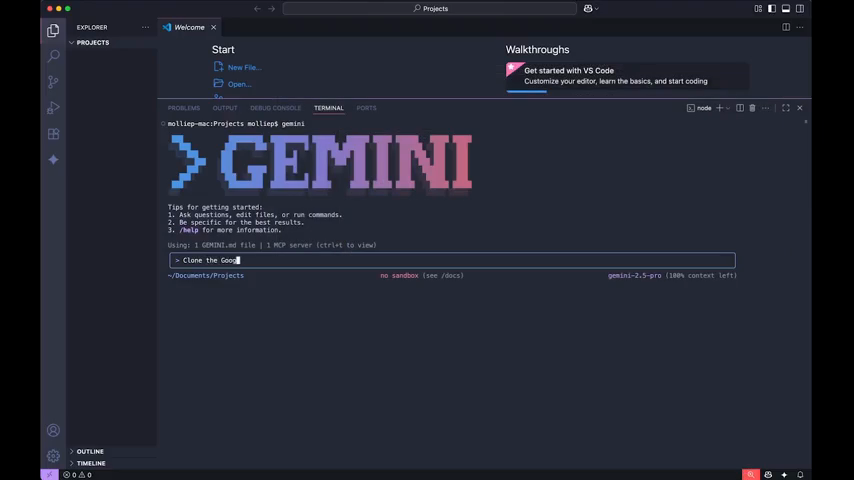
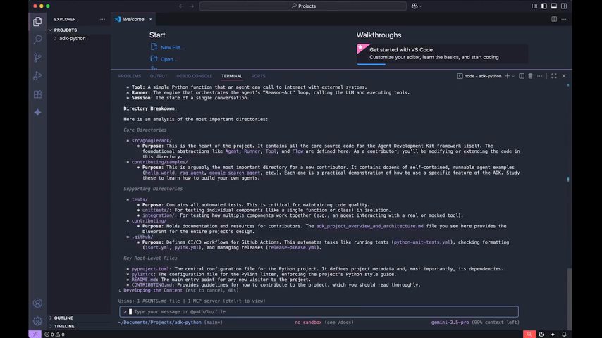

# Inside the Gemini CLI: A Talk with Taylor Mullin

By Emma Morage

In our latest episode of *The Agent Factory*, we looked at a tool that's becoming a mainstay in our workflows: the [Gemini CLI](https://github.com/google-gemini/gemini-cli). It’s a powerful agent that lives right in your command line. I've been using it for a few weeks, and it’s already changed how I work.

*Molly and I starting our deep dive into the Gemini CLI.*

## Solving the Onboarding Problem

Every developer knows the pain of joining a new project. You usually spend hours reading READMEs and trying to understand the architecture. We showed how the Gemini CLI can do this for you. 

I didn't even clone the repo myself. I just asked the CLI to clone Google’s Agent Development Kit (ADK) repo. It found the link, asked for permission, and did the work. Then, I asked for a complete audit. In seconds, it summarized the purpose, tech stack, and architecture.

*The Gemini CLI cloning a repo with a single prompt.*

*A high-level audit of the entire project directory.*

## Building with Itself

We talked to Taylor Mullin, the creator of the tool, about how it all started. One of the most interesting parts was hearing that they use the Gemini CLI to build the Gemini CLI. 

Taylor told us how the CLI wrote its own markdown parser. He was hitting a wall with other frameworks, and the agent one-shotted a custom solution. That code is still in the tool today.

*Taylor explaining how the CLI wrote its own markdown parser.*

## The 100x Mindset

Taylor talked about the difference between 10x and 100x productivity. While AI makes it easy to work 10 times faster, hitting 100x requires running parallel tasks and using "self-healing" features. 

If the CLI runs into a problem it can't solve directly, it finds a workaround. Taylor shared a story where someone wanted to share a link to a project. The CLI didn't have a deploy tool, so it created a GitHub repository and used GitHub Pages to host the site. It’s like having a very scrappy developer on your team.

*A creative workaround using GitHub Pages for deployment.*

## Why Open Source?

Security and trust are big reasons why the Gemini CLI is open source. Taylor wants everyone to see exactly how it works on their machine. The team also relies on the community to help fix bugs and add features. They even post weekly updates on socials with over 100 new features and improvements every Wednesday.

## What's Next?

The future of the Gemini CLI is all about extensions. You'll be able to install new capabilities as easily as running a single command. Whether you need specific tools for Go development or want to connect to social media APIs, these extensions will let you curate your own experience.

You can find the project on GitHub at [google-gemini/gemini-cli](https://github.com/google-gemini/gemini-cli). Give it a try and see how it fits into your workflow.
